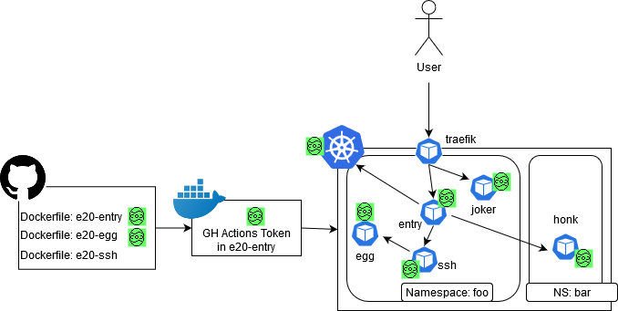

# Kubernetes CTF

These are all resource that are used to setup the Kubernetes Easter CTF. The CTF was hosted on http://k8s-ctf.rocks/ and ended with the end of eastern. The CTF itself was hosted on Amazon EKS. This repository contains a [Vagrantfile](Vagrantfile) (for [HashiCorp Vagrant](https://www.vagrantup.com/)) that allows you to setup the CTF locally. There might be some parts undocumented or not perfectly working, that I forgot to document. Feel free to reach out and we can fix it! :-)



## Setup with Vagrant

To simplify the Installation, a [Vagrantfile](Vagrantfile) is supplied to bootstraps the CTF local on an Ubuntu VM + k3s

You can start it with:
```bash
vagrant up
```
Even if the VM is started, the cluster needs some time to pull all images. The status of the deployment can be tested with following commands:
```bash
# Connect to vm
vagrant ssh

# Get status of pods
kubectl get pods --all-namespaces
```
As soon as the Status is `Running` or `Completed` the cluster can be accessed on [http://localhost:8080](http://localhost:8080).

## Configuration

Most of the configurations can be in adjusted in the config [config](config). The vagrant setup depends on k3s and needs according to the [documentation](https://rancher.com/docs/k3s/latest/en/installation/network-options/) some manual adjustment of the calico deployment.

## Install k3s

In case you want to deploy it on an existing maschine, k3s can installed as following-

```bash
. ./config
curl -sfL https://get.k3s.io | INSTALL_K3S_EXEC="--cluster-cidr=$POD_SUBNET --service-cidr=$SVC_SUBNET --write-kubeconfig-mode=644 --no-flannel" sudo -E sh -
sleep 5
kubectl apply -f calico.yaml
mkdir -p ~/.kube
ln -s /etc/rancher/k3s/k3s.yaml ~/.kube/config
```

## Install Helm

The Kubernetes resources are written in Helm 3 Charts. Following commands are necessary to install Helm 3.

```bash
curl -fsSL -o ~/get_helm.sh https://raw.githubusercontent.com/helm/helm/master/scripts/get-helm-3
chmod 700 ~/get_helm.sh
~/get_helm.sh
rm ~/get_helm.sh
helm repo add stable https://kubernetes-charts.storage.googleapis.com/
```

## Deploy CTF

The CTF can as well deployed with Helm 3 to an existing cluster with the following command.

```bash
./install-with-helm.sh
```

And don't forget to adjust the configuration in the [config](config).

## Docker Images

The Dockerfiles are stored in the [docker-images](docker-images/) directory. The images are build automatically by GitHub Actions and published on Docker Hub:

* [nodyd/e20-entry](https://hub.docker.com/r/nodyd/e20-entry)
* [nodyd/e20-ssh](https://hub.docker.com/r/nodyd/e20-ssh)
* [nodyd/e20-egg](https://hub.docker.com/r/nodyd/e20-egg)

## Fixed issues

- Helm 3 stores all details about the different deployments in the Kubernetes Secrets. Since I stored one EGG in the kubernetes Secret API, the Helm secrets were as well available. According to [Issue #6409](https://github.com/helm/helm/issues/6409) you can decode the complete deployment with 2x base64 decode + gunzp (`kubectl get secrets <helm-deployment> -o json | jq .data.release -r | base64 --decode | base64 --decode | gunzip -`) and all the Kubernetes magic was gone. xD I deleted the Secrets during the CTF manually to avoid the info leak. For now, I relocated the Helm meta info to another namespace.
- I deployed [Datadog Cloud Monitoring](https://www.datadoghq.com/) for the very first time on a cluster. It is nice as an operator to have fancy charts and stats, to name an advantage. Another advantage was for the CTF participants was the service `kube-state-metrics`, which exposed the whole log of my overall deployment. After deploying an additional [NetworPolicy](     datadog-metric-np.yaml), the service was not anymore available.


